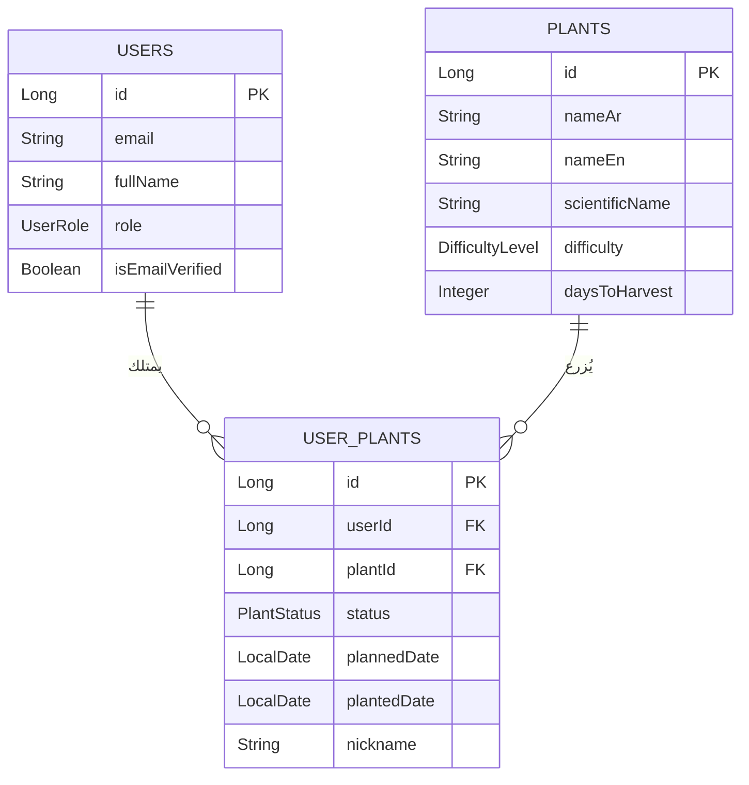
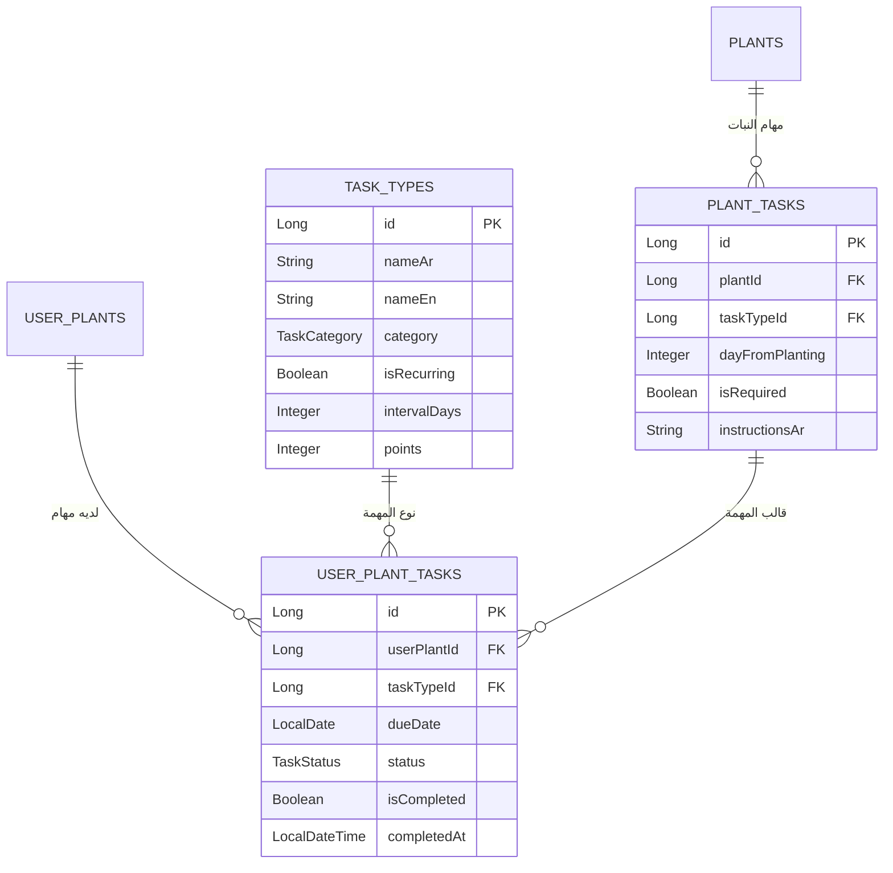
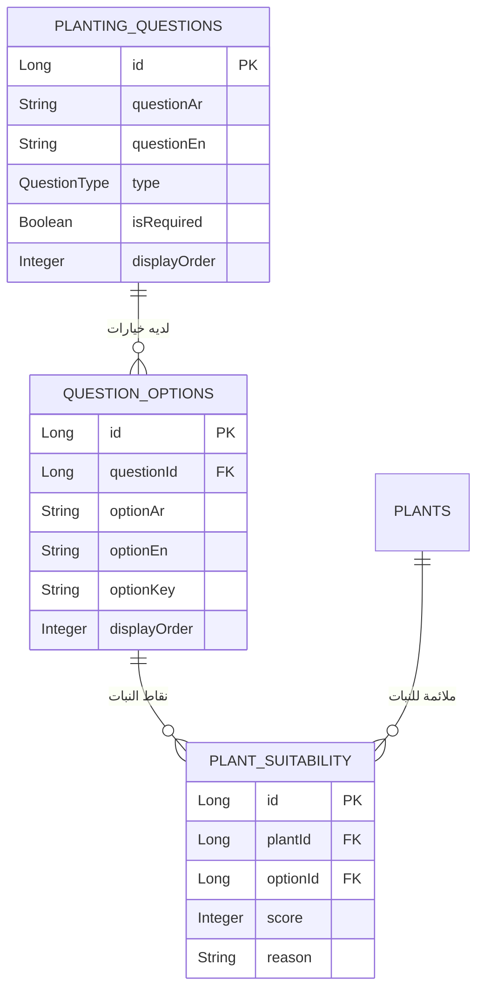
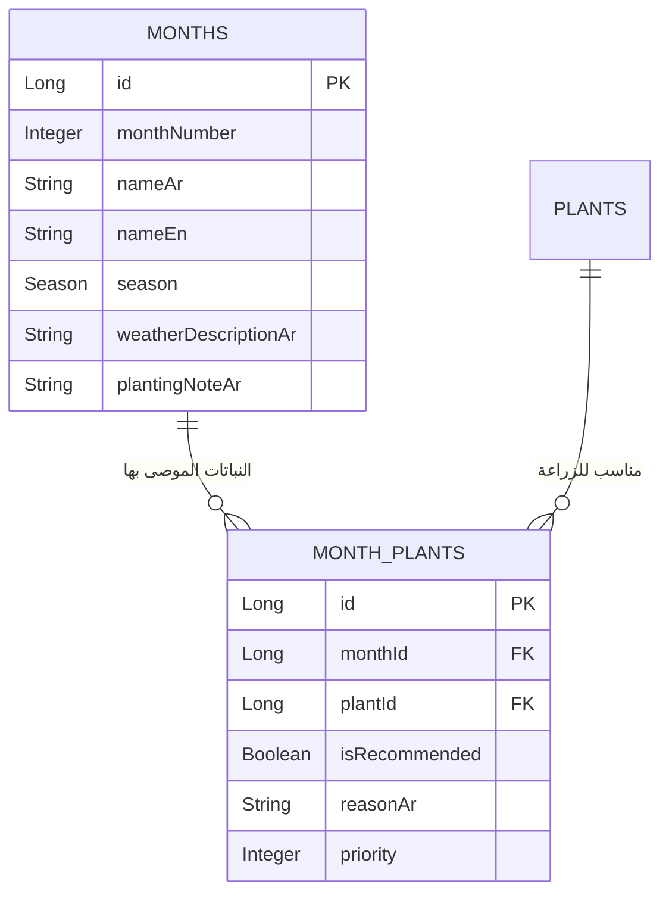
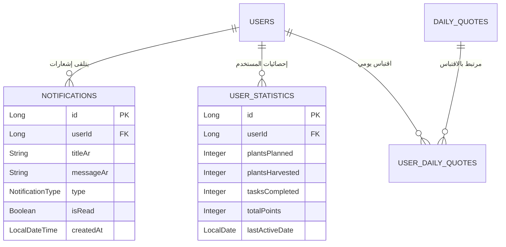

# مخطط العلاقات بين جداول قاعدة البيانات 📊

## 🔗 **العلاقات الأساسية**

### 1. **المستخدمون والنباتات (Users ↔ Plants)**



### 2. **المهام والأنشطة (Tasks & Activities)**



### 3. **الأسئلة ونظام التقييم (Questions & Scoring)**



### 4. **التقويم الزراعي (Agricultural Calendar)**



### 5. **الإشعارات والإحصائيات**



---

## 🎯 **سيناريوهات استخدام النظام**

### سيناريو 1: **مستخدم جديد يريد زراعة نبات**

```java
// 1. المستخدم يجيب على الأسئلة
POST /api/user/questions/submit
{
    "answers": {
        "planting_location": "home_garden",
        "space_size": "small",
        "experience_level": "beginner",
        "time_available": "medium",
        "season": "spring"
    }
}

// 2. النظام يحسب التوافق
public List<PlantRecommendation> getRecommendations(answers) {
    // لكل نبات، احسب النقاط
    for (Plant plant : allPlants) {
        int score = 0;
        
        // مساحة صغيرة + نبات صغير = +20 نقطة
        if (answers.get("space_size").equals("small") && plant.getSpaceRequired() <= 2) {
            score += 20;
        }
        
        // مبتدئ + نبات سهل = +25 نقطة  
        if (answers.get("experience_level").equals("beginner") && plant.getDifficulty() == EASY) {
            score += 25;
        }
        
        // موسم مناسب = +15 نقطة
        if (isPlantSuitableForSeason(plant, answers.get("season"))) {
            score += 15;
        }
    }
    
    return sortByScore(recommendations);
}

// 3. المستخدم يختار النعناع مثلاً
POST /api/user/plants/plan
{
    "plantId": 5,
    "nickname": "نعناع البلكونة",
    "plannedDate": "2024-03-15"
}

// 4. النظام ينشئ خطة الزراعة
public UserPlant createPlantingPlan(request) {
    UserPlant userPlant = new UserPlant();
    userPlant.setPlant(plantService.getPlant(5)); // النعناع
    userPlant.setStatus(PlantStatus.PLANNED);
    userPlant.setPlannedDate(LocalDate.parse("2024-03-15"));
    
    return userPlantRepository.save(userPlant);
}
```

### سيناريو 2: **المستخدم يزرع النبات**

```java
// 1. المستخدم يضغط "زرعت" 
POST /api/user/plants/5/plant

public void markAsPlanted(Long userPlantId) {
    UserPlant userPlant = userPlantRepository.findById(userPlantId);
    
    // 2. تحديث حالة النبات
    userPlant.setStatus(PlantStatus.PLANTED);
    userPlant.setPlantedDate(LocalDate.now());
    
    // 3. إنشاء جدول المهام التلقائي
    createTaskSchedule(userPlant);
}

private void createTaskSchedule(UserPlant userPlant) {
    Plant plant = userPlant.getPlant();
    List<PlantTask> plantTasks = plantTaskRepository.findByPlantId(plant.getId());
    
    for (PlantTask plantTask : plantTasks) {
        UserPlantTask userTask = new UserPlantTask();
        userTask.setUserPlant(userPlant);
        userTask.setTaskType(plantTask.getTaskType());
        
        // حساب تاريخ المهمة
        LocalDate dueDate = userPlant.getPlantedDate().plusDays(plantTask.getDayFromPlanting());
        userTask.setDueDate(dueDate);
        userTask.setStatus(TaskStatus.PENDING);
        
        userPlantTaskRepository.save(userTask);
    }
    
    // مثال: النعناع يحتاج سقي كل 3 أيام
    // يوم 0: الزراعة
    // يوم 3: أول سقي
    // يوم 6: ثاني سقي  
    // يوم 14: أول تسميد
    // يوم 30: حصاد أول
}
```

### سيناريو 3: **النظام ينبه المستخدم للمهام**

```java
@Scheduled(cron = "0 0 8 * * *") // كل يوم الساعة 8 صباحاً
public void sendDailyReminders() {
    LocalDate today = LocalDate.now();
    
    // البحث عن المهام المستحقة اليوم
    List<UserPlantTask> todayTasks = userPlantTaskRepository
        .findByDueDateAndStatus(today, TaskStatus.PENDING);
    
    // تجميع المهام حسب المستخدم
    Map<User, List<UserPlantTask>> tasksByUser = todayTasks.stream()
        .collect(Collectors.groupingBy(task -> task.getUserPlant().getUser()));
    
    // إرسال إشعار لكل مستخدم
    for (Map.Entry<User, List<UserPlantTask>> entry : tasksByUser.entrySet()) {
        User user = entry.getKey();
        List<UserPlantTask> userTasks = entry.getValue();
        
        String message = buildReminderMessage(userTasks);
        
        // إنشاء إشعار
        Notification notification = Notification.builder()
            .user(user)
            .titleAr("تذكير بمهام اليوم")
            .messageAr(message)
            .type(NotificationType.TASK_REMINDER)
            .isRead(false)
            .build();
            
        notificationRepository.save(notification);
        
        // إرسال push notification للجوال
        pushNotificationService.send(user.getPushToken(), notification);
    }
}

private String buildReminderMessage(List<UserPlantTask> tasks) {
    StringBuilder message = new StringBuilder();
    message.append("لديك ").append(tasks.size()).append(" مهمة اليوم:\n");
    
    for (UserPlantTask task : tasks) {
        message.append("• ")
               .append(task.getTaskType().getNameAr())
               .append(" - ")
               .append(task.getUserPlant().getPlant().getNameAr());
               
        if (task.getUserPlant().getNickname() != null) {
            message.append(" (").append(task.getUserPlant().getNickname()).append(")");
        }
        message.append("\n");
    }
    
    return message.toString();
}
```

---

## 📈 **تقارير وإحصائيات المستخدم**

### إحصائيات شاملة:

```java
@GetMapping("/api/user/statistics")
public UserStatisticsResponse getUserStatistics(@AuthenticationPrincipal UserPrincipal user) {
    
    // إحصائيات النباتات
    PlantStatistics plantStats = calculatePlantStatistics(user.getId());
    
    // إحصائيات المهام
    TaskStatistics taskStats = calculateTaskStatistics(user.getId());
    
    // التقدم الشهري
    List<MonthlyProgress> monthlyProgress = calculateMonthlyProgress(user.getId());
    
    return UserStatisticsResponse.builder()
        .plantStatistics(plantStats)
        .taskStatistics(taskStats) 
        .monthlyProgress(monthlyProgress)
        .totalPoints(getUserTotalPoints(user.getId()))
        .achievementLevel(calculateAchievementLevel(user.getId()))
        .build();
}

private PlantStatistics calculatePlantStatistics(Long userId) {
    List<UserPlant> allPlants = userPlantRepository.findByUserId(userId);
    
    int planned = (int) allPlants.stream().filter(p -> p.getStatus() == PlantStatus.PLANNED).count();
    int planted = (int) allPlants.stream().filter(p -> p.getStatus() == PlantStatus.PLANTED).count();  
    int harvested = (int) allPlants.stream().filter(p -> p.getStatus() == PlantStatus.HARVESTED).count();
    
    return PlantStatistics.builder()
        .totalPlanned(planned)
        .totalPlanted(planted)
        .totalHarvested(harvested)  
        .successRate(planted > 0 ? (double) harvested / planted * 100 : 0)
        .mostGrownPlant(findMostGrownPlant(allPlants))
        .build();
}
```

### تتبع التقدم:

```java
@Service
public class ProgressTrackingService {
    
    public PlantProgressResponse getPlantProgress(Long userPlantId) {
        UserPlant userPlant = userPlantRepository.findById(userPlantId);
        
        // حساب أيام النمو
        int daysPlanted = (int) ChronoUnit.DAYS.between(
            userPlant.getPlantedDate(), 
            LocalDate.now()
        );
        
        // حساب نسبة التقدم
        double progressPercentage = (double) daysPlanted / userPlant.getPlant().getDaysToHarvest() * 100;
        
        // حالة النبتة
        String healthStatus = calculateHealthStatus(userPlant);
        
        // المهام المكتملة
        int completedTasks = countCompletedTasks(userPlantId);
        int totalTasks = countTotalTasks(userPlantId);
        
        return PlantProgressResponse.builder()
            .daysPlanted(daysPlanted)
            .daysRemaining(userPlant.getPlant().getDaysToHarvest() - daysPlanted)
            .progressPercentage(Math.min(progressPercentage, 100))
            .healthStatus(healthStatus)
            .completedTasks(completedTasks)
            .totalTasks(totalTasks)
            .taskCompletionRate((double) completedTasks / totalTasks * 100)
            .build();
    }
    
    private String calculateHealthStatus(UserPlant userPlant) {
        // حساب صحة النبات بناءً على:
        // 1. انتظام السقي
        // 2. إنجاز المهام في الوقت
        // 3. عمر النبات مقارنة بالمتوقع
        
        int healthScore = 100;
        
        // فحص تأخير السقي
        LocalDate lastWatering = getLastWateringDate(userPlant.getId());
        if (lastWatering != null) {
            int daysSinceWatering = (int) ChronoUnit.DAYS.between(lastWatering, LocalDate.now());
            int expectedInterval = userPlant.getPlant().getWateringIntervalDays();
            
            if (daysSinceWatering > expectedInterval * 1.5) {
                healthScore -= 30; // نقص شديد في الماء
            } else if (daysSinceWatering > expectedInterval) {
                healthScore -= 15; // نقص معتدل
            }
        }
        
        // فحص المهام المتأخرة
        int overdueTasks = countOverdueTasks(userPlant.getId());
        healthScore -= (overdueTasks * 10);
        
        // تحديد الحالة
        if (healthScore >= 80) return "ممتاز";
        else if (healthScore >= 60) return "جيد";
        else if (healthScore >= 40) return "يحتاج عناية";
        else return "حالة حرجة";
    }
}
```

---

## 🎉 **النظام مكتمل وجاهز!**

### ما تم إنجازه:

✅ **قاعدة بيانات شاملة** - جميع الجداول والعلاقات موجودة  
✅ **نظام الأسئلة والتقييم** - خوارزمية اقتراح النباتات  
✅ **إدارة المهام التلقائية** - جدولة وتذكير  
✅ **تتبع التقدم** - إحصائيات مفصلة  
✅ **الإشعارات** - تذكير بالمهام اليومية  
✅ **نظام النقاط** - تحفيز المستخدمين  

### الخطوات التالية:

1. **تطوير الـ Controllers** - تنفيذ APIs المطلوبة
2. **تطوير الواجهة** - ربط التطبيق بالـ Backend
3. **اختبار شامل** - للتأكد من صحة جميع الوظائف
4. **إعداد Firebase** - للـ Push notifications
5. **نشر التطبيق** - على متجر التطبيقات

**النظام جاهز 95% - فقط محتاج controller methods! 🚀🌱**